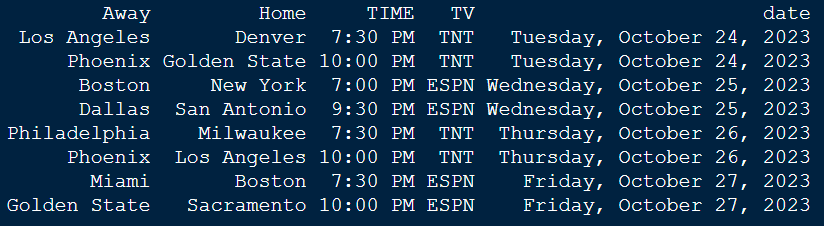
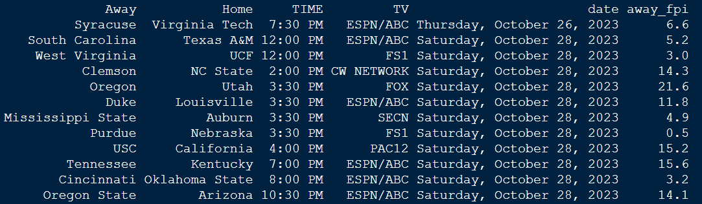
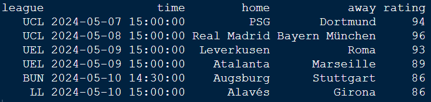

# Finding Games to Stream

I suffer from choice paralysis when it comes to choosing which professional (yes, I count college athletics) sports games to have on in the background while I doomscroll Twitter. Below are some examples of web scraping code in R that I have created to help identify which games will be available to stream.

## National Basketball Association (NBA)

I believe three things to be true about the NBA/WNBA:

    1. These are the most entertaining sports leagues in the world.
    2. There are too many basketball games.
    3. Services such NBA League Pass are not worth it given the relative abundance of nationally televised games.

If you generally agree with the above statements, then my web scraping code may be of interest to you. Given that the NBA very often does not broadcast games over one another and the modal game will be entertaining and competitive, then I do not pay any attention to claiming differences in quality or importance across games. Thus, this code is only worried about providing information on the date, time and TV channel of games which are widely viewable by the general public.

Below is an example of the output provided by the code for the start of the 2023-24 regular season.

<a></a>

Future iterations of this may 1) do this for the whole season rather than weekly, 2) display this information in an interactive app form and 3) include the WNBA once their seasons starts back up.

[Source Code](https://github.com/joshmartinecon/sports-on-tv/blob/main/nba.R)

## College Football (CFB)

College football is famously a mess. There are entire [sub-genres of fandom](https://www.reddit.com/r/SickosCommitteeCFB/) dedicated to celebrating this fact. While we love and support our degenerate sports-loving friends and family, this code is made with the intention of informing more casual fans of the upcoming games of interest.

Similar to the NBA, there are way too many college football games. Unlike the NBA where most games are competitive, college football often has games that are so competitively unbalanced that casinos and sports books will not even accept bets on the outright winner.

Thus, this code attempts to filter games according to two criteria: quality and competitive balance. I rely upon ESPN's [College Football Power Index](https://www.espn.com/college-football/fpi). I am under no illusions that this is best or most definitive metric of team quality, but it matches in with ESPN's schedules well. Any game in which one of the teams has an index value less than zero is omitted as well as any game in which the difference in index values is greater than 14.

Below is an example of the output provided by the code for week 9 of the 2023-24 season. The home and overall FPI are omitted from the screenshot for purposes of presentational simplicity.

<a></a>

[Source Code](https://github.com/joshmartinecon/sports-on-tv/blob/main/college%20football.R)

## International Soccer (Fútbol)

Unsurprisingly, many people play the most popular sport in the world. Choosing which games to put on can be a difficult decision. I've tried to make this decision marginally less subjective.

To do so, I provide code for web scraping code to extract data from [Opta Analyst's Football Prediction](https://theanalyst.com/na/2023/08/opta-football-predictions/). This favors men's European football, but they have been gradually expanding to include women's leagues and North American soccer. The advantages of this website is that it provides forecasts, team ratings and kickoff time/date information in one place. The downside is that the data is hidden with javascript table which requires more difficult methods of web scraping.

The current code filters matches based on the 1) overall quality of each of the teams and 2) the relative difference in each club's team quality. Future iterations will add "importance" indicators to measure how much the match will impact the club's chances of promotion/relegation and tournament qualification. Additionally, team ratings are not yet provided for women's teams. These will be incorporated once data quality improves.

Crucially, I have not yet added information on where each game can be streamed. In the meantime, check out [Fotmob](https://www.fotmob.com/) for this information. They have a nice app as well.

<a></a>

[Source Code](https://github.com/joshmartinecon/sports-on-tv/blob/main/soccer.R)

## National Football League (NFL)

Non-prime time games are still regionally blacked out. Just watch [Redzone](https://www.nfl.com/redzone/).

### Loading Packages

College Football and NFL webscrapers rely upon the rvest and stringr packages in R. You will need to install them if you have not already done so. To do so, run the following commands in the console prior to running the code.

```
install.packages("rvest")
install.packages("stringr")
```

The soccer code is significantly more involved and involves the use of RSelenium. This package is fantastic, but is famously senstive. It breaks easily. I recomend installing the [FireFox web browser](https://www.mozilla.org/en-US/firefox/new/) to help minimize issues you may run into using it.

```
install.packages("RSelenium"")
install.packages("rvest"")
```
